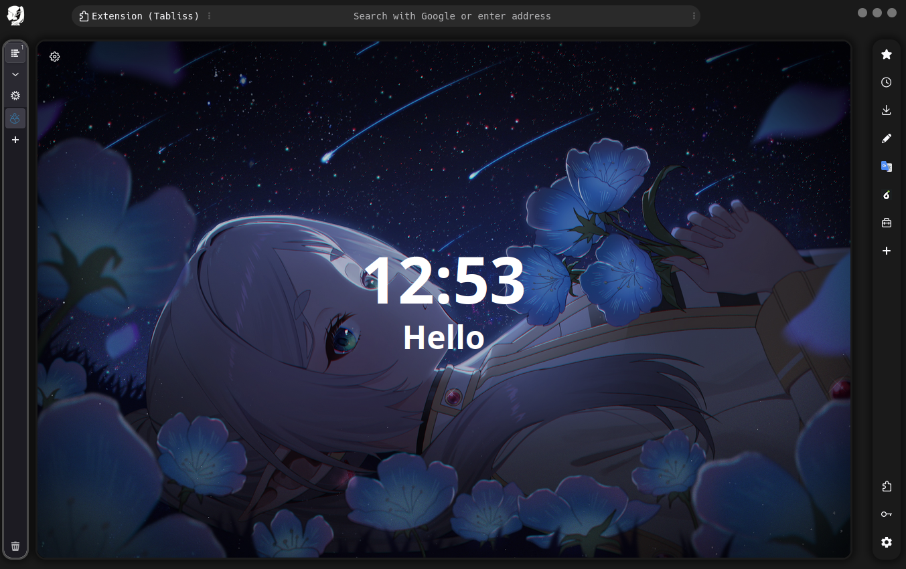

# Shina Fox - Make Firefox a Cozy Home

Welcome to Shina Fox, a project that seeks to transform your Firefox experience into something homely and comfortable. At the moment, it primarily focuses on theme development. Enjoy!

<table>
  <tr>
    <td>  </td>
    <td>  </td>
  </tr>
</table>


## Set-up Guide 🛠️

##### Step 1: Sidebery Configuration 🦔
- Firstly, install the [Sidebery Addon](https://addons.mozilla.org/firefox/addon/sidebery/). 
- Navigate to Sidebery's `Settings` ⚙️ --> `Navigation bar` 📍
- Turn off the `Show navigation bar in one line` option.
- Proceed to Sidebery's `Setting` ⚙️ --> `Style editor` 🎨
- Finally, copy and paste the following CSS code snippet into the provided space:

```csharp
#root.root {--tabs-font: 1rem Monospace;}
#root.root {--ctx-menu-font: 1rem Monospace;}
#root.root {--ctx-menu-min-width: 256px;}
#root.root {--ctx-menu-max-width: 9999px;}

/* unloaded tab title style */
.Tab[data-discarded="true"] .title {
    opacity: 80%;
}

/* adjustments */
#root.root {--tabs-indent: 16px;}
#root.root {--tabs-audio-btn-width: 32px;}
#root.root {--tabs-inner-gap: 4px;}

/*** hover effects ***/
#root:not(:hover) {
    --tabs-indent: 0px;
}
/* ident indicator ********************************************/
/* Settings > Tabs > Show marks to indicate tabs sub-tree levels > on */
.Tab .title {
    transition: margin-left 300ms ease;
}
.Tab:hover {
    --tabs-inner-gap: 8px;
}
.Tab:hover .title {
    margin-left: 8px;
}
```

##### Step 2: Firefox Configuration ⚙️
- In the URL bar, enter `about:config` (Accept the Risk and Continue)
- Adjust the configuration as per the following table:

| Configuration Parameter 🛠️ | Required Setting 🎛️ |
| ---- | ---- |
| `toolkit.legacyUserProfileCustomizations.stylesheets` | `true` |
| `widget.gtk.ignore-bogus-leave-notify` | `1`  |
| `floorp.browser.user.interface` (Only if you are using Floorp) | `1` |
| `browser.newtabpage.activity-stream.floorp.newtab.backdrop.blur.disable` (Only if you are using Floorp) | `1` |

##### Step 3: Theme Selection 🎨
- In the URL bar, type `about:addons`
- Navigate to the `Theme` section and select ‘Dark’, ‘Light’, or any other preferred [theme](https://addons.mozilla.org/en-US/firefox/themes/). Ensure it is not the `System theme - auto`.

##### Step 4: File Installation 🗂️
- Enter `about:profiles` in the URL bar
- Identify your current profile and click on `Open Directory` in the `Root Directory` section
- Create a `chrome` folder if one doesn't already exist
- Download the [latest version](https://github.com/Shina-SG/Shina-Fox/releases/latest) 
- Unzip the downloaded files and transfer them into the `chrome` folder

Restart Firefox to experience your new cozy haven! 💓🎉

## Feature Breakdown 🌟
| Feature Name 🌈 | Preview 📸 |
| ---- | ---- |
| Adaptive Theme |  |
| MacOS Buttons |  |
| Highlight Border |  |
| Auto Hide Sidebery |  |
| Minimal Extension Menu |  |
| Enchanted URL Bar |  |
| Custom Icon |  |
| Hovering Bookmark |  |

## Upcoming Improvements:
| Project Section | Current Status |
| ---- | ---- |
| Theme | Released |
| Extension | In Progress |
| Config | In Progress |
| Guide | In Progress |

## Appreciation 🌟: 
Whilst I am a newbie in the world of programming, I've been using codes and inspiration of the community. Please check out their incredible work:

| Credits 📝 |
| ---- |
| [Firefox Mod Blur - datguypiko](https://github.com/datguypiko/Firefox-Mod-Blur) |
| [Firefox-ONE - Godiesc](https://github.com/Godiesc/firefox-one) |
| And more... |
